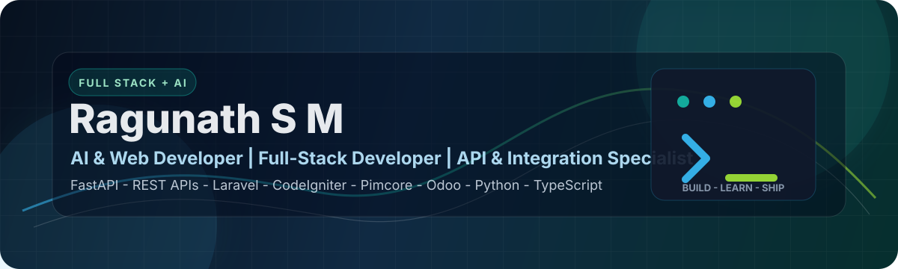
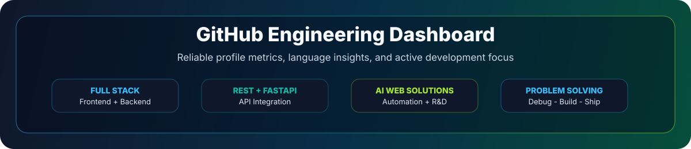

  

  
  
  
  

  

<h3 align="center">
  AI &amp; Web Developer @ Navabrind IT Solutions Pvt Ltd | AI-Driven Web Solutions | Tech Enthusiast | Full-Stack Developer | API &amp; Integration Specialist | Problem Solver | Passionate Coder
</h3>

  <code>Laravel</code> &nbsp;|&nbsp; <code>CodeIgniter</code> &nbsp;|&nbsp; <code>Pimcore</code> &nbsp;|&nbsp; <code>Odoo</code> &nbsp;|&nbsp; <code>FastAPI</code> &nbsp;|&nbsp; <code>REST APIs</code> &nbsp;|&nbsp; <code>AI Automation</code>

  
  
  

  

## Mission Control

<table>
  <tr>
    <td width="50%">
      <h3>Who I Am</h3>
      

        I am <b>Ragunath S M</b>, an <b>AI &amp; Web Developer</b>, <b>Full-Stack Developer</b>, and <b>R&amp;D Lead</b> at <b>Navabrind IT Solutions Pvt Ltd</b>. I build AI-assisted web products, automation workflows, internal tools, REST API integrations, and scalable backend systems that solve real business problems.
      

      

        My work blends product thinking, frontend delivery, backend engineering, FastAPI services, API integration, database design, and clean user experiences.
      

    </td>
    <td width="50%">
      <h3>Current Focus</h3>
      

        
        
        
      

      

        
        
        
      

      

        I care about software that is useful, maintainable, fast to operate, easy to integrate, and simple for users to understand.
      

    </td>
  </tr>
</table>

## Profile Snapshot

<table>
  <tr>
    <td align="center" width="25%">
      <h3>2023</h3>
      
B.Tech IT Graduate

    </td>
    <td align="center" width="25%">
      <h3>R&amp;D</h3>
      
AI + Web Exploration

    </td>
    <td align="center" width="25%">
      <h3>Full Stack</h3>
      
UI + Backend + APIs

    </td>
    <td align="center" width="25%">
      <h3>FastAPI</h3>
      
REST API Specialist

    </td>
  </tr>
</table>

  

## Tech Arsenal

<table>
  <tr>
    <td width="33%" valign="top">
      <h3>Languages</h3>
      

        
      

      
PHP, Python, HTML, CSS, JavaScript, TypeScript, Java

    </td>
    <td width="33%" valign="top">
      <h3>Frontend</h3>
      

        
      

      
Responsive UI, dashboards, forms, API-connected screens, admin panels, and component-based interfaces.

    </td>
    <td width="33%" valign="top">
      <h3>Backend</h3>
      

        
      

      
Laravel, CodeIgniter, FastAPI, Pimcore, Odoo 17/18/19, REST APIs, authentication, workflows, and server-side logic.

    </td>
  </tr>
</table>

  
  
  
  
  
  
  

<table>
  <tr>
    <td width="50%" valign="top">
      <h3>Databases</h3>
      

        
      

      
MySQL, MongoDB, PostgreSQL, Redis, query design, caching, and data modeling.

    </td>
    <td width="50%" valign="top">
      <h3>Tools and AI Workflow</h3>
      

        
      

      
Git, GitHub, Linux, VS Code, Postman, Docker, cloud basics, debugging, documentation, and deployment workflows.

    </td>
  </tr>
</table>

  
  
  
  
  

## Technical Depth

<table>
  <tr>
    <td width="50%" valign="top">
      <h3>Backend and API Engineering</h3>
      

        REST API design, third-party API integration, FastAPI services, Laravel modules, CodeIgniter applications, authentication flows, request validation, backend debugging, and business workflow automation.
      

    </td>
    <td width="50%" valign="top">
      <h3>Full-Stack Delivery</h3>
      

        Frontend screens, admin dashboards, API-connected forms, database-backed features, deployment support, production fixes, clean documentation, and fast iteration with teams.
      

    </td>
  </tr>
  <tr>
    <td width="50%" valign="top">
      <h3>AI-Driven Web Solutions</h3>
      

        AI-assisted development, prompt workflows, chatbot concepts, automation ideas, internal productivity tools, and R&amp;D experiments that convert new technology into practical products.
      

    </td>
    <td width="50%" valign="top">
      <h3>Enterprise Platforms</h3>
      

        Pimcore, Odoo 17/18/19, Laravel ecosystems, database management, API-based integrations, and maintainable backend structures for business applications.
      

    </td>
  </tr>
</table>

  

## Experience Map

<table>
  <tr>
    <td width="25%" align="center">
      <h3>Full-Stack Development</h3>
      
Frontend screens, backend logic, databases, integrations, and production-ready web application delivery.

    </td>
    <td width="25%" align="center">
      <h3>R&amp;D Leadership</h3>
      
Researching ideas, validating feasibility, prototyping fast, and converting experiments into working products.

    </td>
    <td width="25%" align="center">
      <h3>API Systems</h3>
      
FastAPI, REST APIs, third-party integrations, Postman testing, workflows, and maintainable service logic.

    </td>
    <td width="25%" align="center">
      <h3>Product Delivery</h3>
      
UI, backend, integrations, testing, debugging, deployment, and continuous improvement.

    </td>
  </tr>
</table>

## LinkedIn and Portfolio Highlights

<table>
  <tr>
    <td width="33%" valign="top">
      <h3>Professional Identity</h3>
      

        AI &amp; Web Developer at Navabrind IT Solutions Pvt Ltd with focus on AI-driven web solutions, full-stack development, API integrations, problem solving, and continuous learning.
      

    </td>
    <td width="33%" valign="top">
      <h3>Client and Team Exposure</h3>
      

        Experience collaborating around digital transformation, AI-driven innovation, global client discussions, teamwork, and business-focused technology delivery.
      

    </td>
    <td width="33%" valign="top">
      <h3>Recognized Strengths</h3>
      

        Technical knowledge, quick learning, collaborative attitude, professionalism, communication, adaptability, and ability to handle complex requirements.
      

    </td>
  </tr>
</table>

  
  
  
  
  
  

## Education

<table>
  <tr>
    <td width="35%"><b>College</b></td>
    <td>Mailam Engineering College</td>
  </tr>
  <tr>
    <td><b>Degree</b></td>
    <td>B.Tech, Information Technology</td>
  </tr>
  <tr>
    <td><b>Batch</b></td>
    <td>2019 - 2023</td>
  </tr>
  <tr>
    <td><b>Location</b></td>
    <td>Villupuram, Tamil Nadu</td>
  </tr>
</table>

## Learning Highlights

  
  
  
  
  
  
  
  
  

  

## Projects Lab

<table>
  <tr>
    <td align="center">
      <h3>Project case studies coming soon</h3>
      

        This space is reserved for selected live demos, GitHub repositories, screenshots, and implementation notes. It will be strongest when only polished, useful projects are added here.
      

      

        
        
      

    </td>
  </tr>
</table>

## GitHub Analytics

  

  
  

  

## Career Direction

<table>
  <tr>
    <td>
      

        My goal is to grow as a strong <b>AI Web Developer</b> and <b>R&amp;D leader</b> who can design intelligent web platforms, integrate AI into real business workflows, and lead teams that ship meaningful products.
      

      

        I am focused on improving in full-stack engineering, AI tooling, product research, system design, scalable backend architecture, and practical automation that helps teams move faster.
      

    </td>
  </tr>
</table>

## Connect

  
  
  
  

  <b>Open to AI web development, backend engineering, R&amp;D, automation, API integration, and full-stack collaboration.</b>

